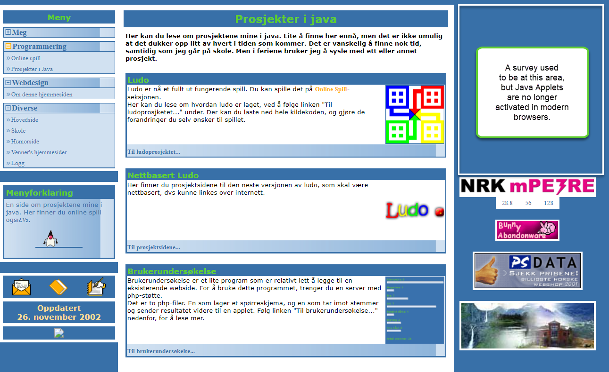
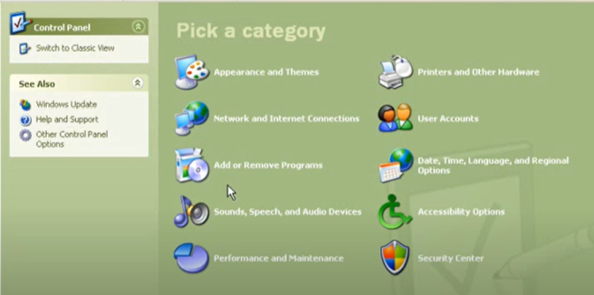
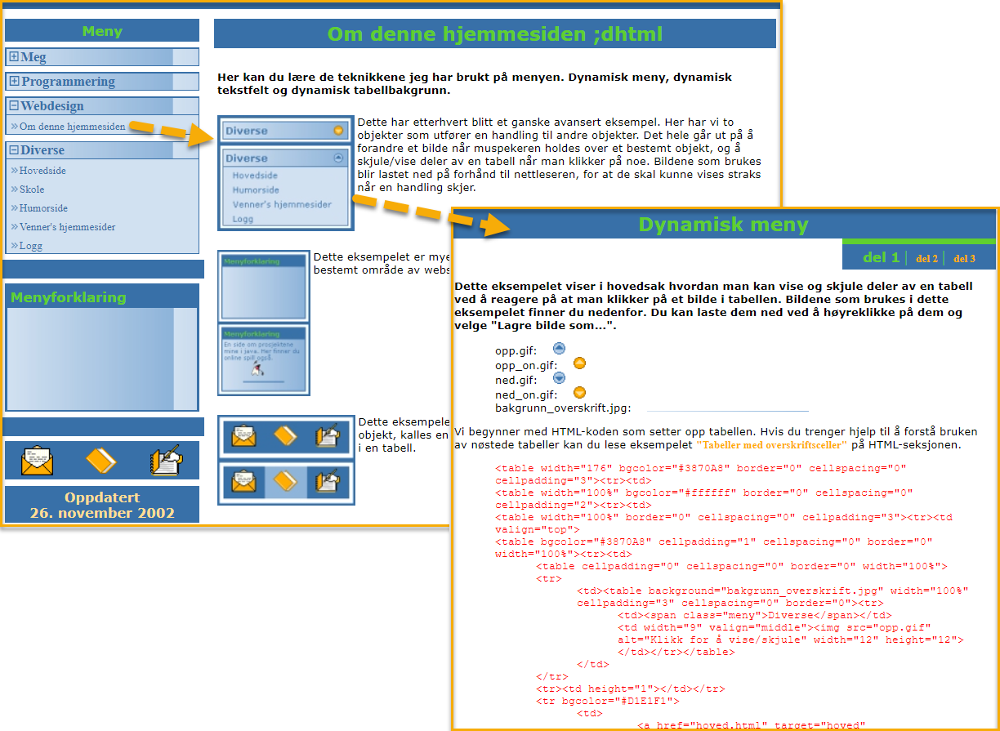
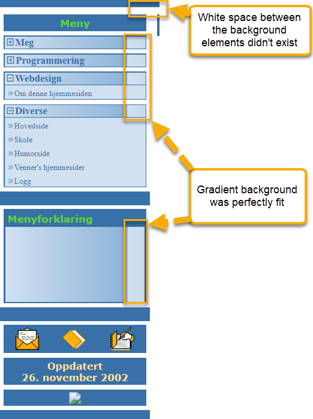

# My personal homepage from 2001

After seeing this TikTok video, I decided to publish my own personal homepages from early days again. I found three of my old homepages on an old backup DVD some years ago, and now they're all on GitHub and hosted for free on Azure Static Websites.

You can see my homepage from 2001 here [https://2001.eivindgl.com](https://2001.eivindgl.com). 
[](https://2001.eivindgl.com)

It had a lot of content about things I was interested in:
 - Java applets and the implementation of Ludo
 - Webdesign with DHTML
 - Summaries of syllabus at the college/university

The 2001 homepage was actully way better than what I've got out there today. 

## TikTok video that inspired me
[](https://www.tiktok.com/@tamsininnit/video/7130172463735934214)
<blockquote class="tiktok-embed" cite="https://www.tiktok.com/@tamsininnit/video/7130172463735934214" data-video-id="7130172463735934214" style="max-width: 605px;min-width: 325px;" > <section>
<a target="_blank" title="@tamsininnit" href="https://www.tiktok.com/@tamsininnit">@tamsininnit</a> <a title="this" target="_blank" href="https://www.tiktok.com/tag/this">#This</a> is my 25th year as a front end web developer 😅 <a title="womenintech" target="_blank" href="https://www.tiktok.com/tag/womenintech">#womenintech</a> <a title="webdev" target="_blank" href="https://www.tiktok.com/tag/webdev">#webdev</a> <a title="millennial" target="_blank" href="https://www.tiktok.com/tag/millennial">#millennial</a> <a title="borninthe80s" target="_blank" href="https://www.tiktok.com/tag/borninthe80s">#borninthe80s</a> <a target="_blank" title="♬ Horror, suspense, weirdness, ghost, UFO - Zassh" href="https://www.tiktok.com/music/Horror-suspense-weirdness-ghost-UFO-6817169438580672514">♬ Horror, suspense, weirdness, ghost, UFO - Zassh</a> </section> </blockquote> 

` `

## 1998 and 2000 homepages
The 2001 homepage had improved a lot compared to the predessors from 1998 and 2000.
 - [1998 homepage](https://github.com/eloekset/1998-homepage)
 - [2000 homepage](https://github.com/eloekset/2000-homepage)

## Techniques
The main layout used framesets, which was a great way to separate the page in different elements, to keep the menu as a part separated from all of the acutal pages on the website. The frameset also included 10 pixel bars at top and bottom, just to wrap the page in a nice background color. The main content got only 560 pixels width, which together with the menu filled all space of a 800x600 screen resolution. For higher resolutions, a banner at the right side was used to display ads. I didn't make any money on these ads. I included them to support the things I cared about, and this layout was similar to the most popular newspapers websites at that time, so it gave my homepage a more professional look.

If the browser didn't support frames, you wouldn't see any content at all. I guess I assumed that nearly everyone used browsers with support for framesets at that time.

```
<frameset rows="10,*,10" framespacing="0"> 
  <frame name="topp" src="blank.html" frameborder="0" marginwidth="0" marginheight="0" noresize scrolling="no">
  <frameset cols="200, 560, *"> 
    <frame name="meny" src="meny.html" frameborder="0" marginwidth="0" marginheight="0" noresize scrolling="auto">
    <frame name="hoved" src="hoved.html" frameborder="0" marginwidth="0" marginheight="0" noresize scrolling="auto">
    <frame name="info" src="annonse.html" frameborder="0" marginwidth="0" marginheight="0" noresize scrolling="auto">
  </frameset>
  <frame name="bunn" src="blank.html" frameborder="0" marginwidth="0" marginheight="0" noresize scrolling="no">
</frameset>
<noframes> 
</noframes> 
```

The menu layout had improved significantly from the 1998 and 2000 homepages I made. This one used JavaScript again, like the 1998 version, but the layout now copied the design of [Control Panel in Windows XP](https://youtu.be/nPKdNO62fjM?t=53). Not many websites tried to copy the look and feel of Windows XP, and since Windows XP was brand new and fresh at that time, it gave my homepage a rather impressive look.



### DHTML
The menu included a description field below all other elements, that was used to describe the menu item that the mouse was currently hovering. All this functionality was made with HTML, CSS and JavaScript, which combined was referred to as [DHTML](https://en.wikipedia.org/wiki/Dynamic_HTML).

A section of the website was dedicated to describing the techniques I used in great detail:


### CSS
The way CSS was rendered varied a lot between different browsers at that time. Today this has improved quite a lot, but as a result of that you can probably no longer find a browser that renders this website perfectly. Maybe, if it's possible to install Windows XP without all the service packs that came after 2003 you could see exactly how it looked back in the days.

